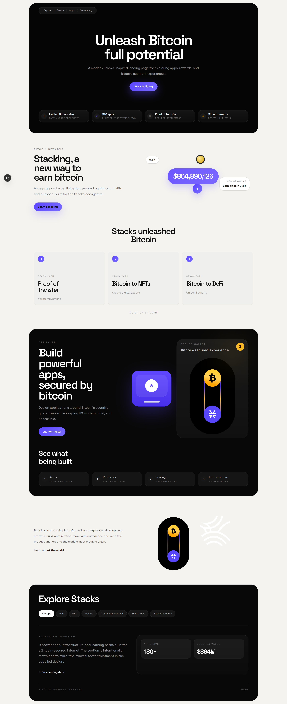

# CoinFusion Landing Page

Single-page landing page built with Next.js and Tailwind CSS. The design is based on the supplied CoinFusion / Stacks-style visual reference and focuses on a polished marketing presentation rather than app functionality.

## Preview



## Overview

This project is a responsive crypto-themed landing page with:

- A dark hero section with centered headline and feature chips
- A white stacking section with metric callouts and conversion cards
- A black app showcase section with wallet/security visuals
- A split content section with supporting visuals
- A final explore section with ecosystem filters and summary stats

## Stack

- Next.js 16
- React 19
- Tailwind CSS 4
- `next/image` for optimized image rendering
- `next/font` with Space Grotesk as the primary face

## Run Locally

Install dependencies and start the dev server:

```bash
pnpm install
pnpm dev
```

Open [http://localhost:3000](http://localhost:3000).

## Project Structure

```text
app/
  globals.css
  layout.tsx
  page.tsx
public/
  coinfusion-preview.png
  mask2.svg
  Mask group.svg
  yen.svg
```

## Notes

- This repository contains a landing page only.
- The main implementation lives in [app/page.tsx](./app/page.tsx).
- The screenshot in this README was generated from the local site running on `localhost:3000`.
