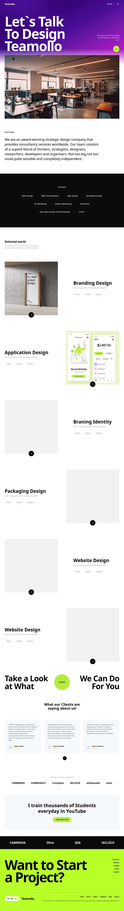

# Teamollo Landing Page

A beautifully crafted, high-fidelity, and fully responsive landing page for the fictional design agency **Teamollo**, built to pixel-perfect parameters based on the original design reference. It leverages Next.js, React, and modern Tailwind CSS to provide a clean, accessible, and fast experience.



## Overview

This project was built to illustrate advanced structured landing page design implementing:
- **Mesh Gradients**: A beautifully structured mesh hero gradient transitioning cleanly into a white background layout.
- **Alternating Component Layouts**: Perfect alternating zig-zag card grid.
- **Tailwind CSS Flexbox & Grid Patterns**: Clean structure spanning all breakpoints (mobile, tablet, desktop).
- **Smooth Integrations**: Custom `lucide-react` icons that scale dynamically.

## Getting Started

First, install dependencies and start the development server:

```bash
npm install
npm run dev
# or
yarn dev
# or
pnpm dev
# or
bun dev
```

Open [http://localhost:3000](http://localhost:3000) with your browser to see the result.

## Tech Stack

- **Next.js** - React Framework
- **Tailwind CSS** - Utility-first CSS framework
- **Lucide React** - SVG Icons
- **Vercel** - Deployment 
