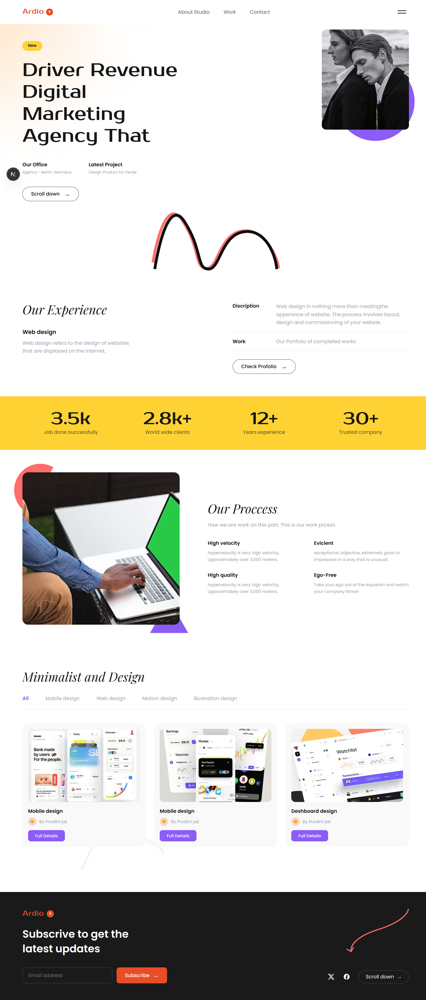

# Ardio – Digital Marketing Agency Landing Page

A pixel-perfect landing page for **Ardio**, a fictional digital marketing agency. Built with Next.js 16, Tailwind CSS v4, and TypeScript.



---

## ✨ Features

- **Responsive layout** – Desktop-first design that gracefully adapts to smaller screens
- **Component-driven architecture** – 7 modular, reusable sections
- **Custom typography** – Poppins, Prosto One, and Playfair Display via `next/font/google`
- **Tailwind CSS v4** – Utility-first styling with inline theme tokens
- **Decorative SVG assets** – Hand-crafted arch lines, ellipses, and swooping curves
- **Optimised images** – Served through `next/image` with lazy loading and priority hints

## 🧩 Sections

| # | Section        | Description                                                |
|---|----------------|------------------------------------------------------------|
| 1 | **Navbar**     | Branded logo, navigation links, hamburger menu             |
| 2 | **Hero**       | Gradient blob, headline, info columns, B&W photo, arch SVGs |
| 3 | **Experience** | Service overview with description/work table               |
| 4 | **Stats**      | Key metrics on a vibrant yellow accent strip               |
| 5 | **Process**    | Decorated workspace photo with 2×2 feature grid            |
| 6 | **Portfolio**  | Filterable project cards with mockup previews              |
| 7 | **Footer**     | Subscribe form, social links, decorative arrow SVG         |

## 🛠 Tech Stack

- [Next.js 16](https://nextjs.org/) – React framework with App Router
- [React 19](https://react.dev/)
- [Tailwind CSS v4](https://tailwindcss.com/) – Utility-first CSS
- [TypeScript](https://www.typescriptlang.org/)

## 🚀 Getting Started

```bash
# Install dependencies
bun install      # or npm install

# Start the dev server
bun dev          # or npm run dev
```

Open [http://localhost:3000](http://localhost:3000) in your browser.

## 📁 Project Structure

```
app/
├── components/
│   ├── Navbar.tsx
│   ├── Hero.tsx
│   ├── Experience.tsx
│   ├── Stats.tsx
│   ├── Process.tsx
│   ├── Portfolio.tsx
│   └── Footer.tsx
├── globals.css
├── layout.tsx
└── page.tsx
public/
├── heroimg.png
├── feature.png
├── service.png / service1.png / service2.png
├── Ellipse.svg / hero1.svg / hero2.svg
├── bottomline.svg / footer1.svg / footer2.svg
└── preview.png
```

## 📄 License

This project is for educational and portfolio purposes.
