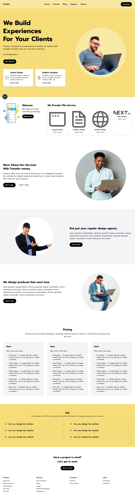

## Portfolio Landing Page — Next.js 16 + Tailwind v4

A responsive portfolio/agency landing page implemented with the App Router in Next.js 16 and Tailwind CSS v4. The layout matches the provided design mock, including a split hero, service cards, circular imagery, pricing, a two-column numbered FAQ, and a simple footer.

### Preview



---

## Features

- Responsive layout across mobile, tablet, and desktop
- Clean semantic structure using the App Router (`app/`)
- Tailwind CSS v4 theme tokens for colors and typography
- Optimized images via `next/image`
- Accessible focusable buttons and clear content hierarchy
- Zero console errors in development

## Tech Stack

- Next.js 16 (App Router, Turbopack dev)
- React 19
- Tailwind CSS v4
- TypeScript

## Project Structure

```
06_portfoliolandingpage/
├─ app/
│  ├─ layout.tsx        # Root layout and font wiring
│  ├─ page.tsx          # Landing page sections
│  └─ globals.css       # Tailwind v4 theme + base styles
├─ public/
│  ├─ preview.png       # Auto-generated screenshot of the page
│  └─ assets...         # Images & icons used by the page
├─ next.config.ts
├─ tsconfig.json
├─ eslint.config.mjs
├─ postcss.config.mjs
└─ README.md
```

## Getting Started

### Prerequisites

- Node.js 20+ recommended
- Package manager: Bun, npm, pnpm, or Yarn

### Install

```bash
# using Bun (recommended for speed)


# or with npm
npm install
```

### Run (development)

```bash
bun run dev
# or
npm run dev
```

The app runs at http://localhost:3000

### Build and Start (production)

```bash
# build
npm run build

# start after build
npm run start
```

### Scripts

- `dev`   — start Next.js in development (Turbopack)
- `build` — create an optimized production build
- `start` — run the production server
- `lint`  — run ESLint

## Customization

- Update copy and section content in `app/page.tsx`.
- Adjust theme colors and fonts in `app/globals.css` under `@theme inline`.
- Public assets live under `public/`.

## Notes

This repository uses the current Next.js 16 conventions. Some APIs have changed from earlier versions; refer to Next.js docs when adding routes or server components.

## License

This repository does not declare a license. Treat usage according to your organization’s policies or add a LICENSE file if needed.
