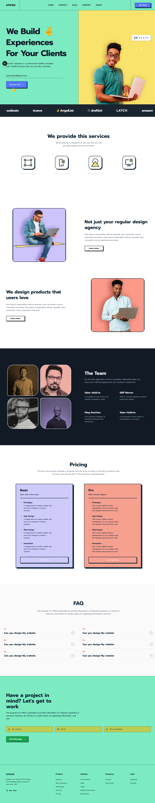

# Portfolio Landing Page Makeover

A stunning, pixel-perfect neo-brutalist landing page for digital agencies and creative studios.



## Overview

This project is a high-fidelity visual reconstruction of a provided design reference, focusing on:
- High-contrast Neo-brutalist aesthetics
- Fluid layout scaling with complex, asymmetrical squircle grid placements
- Dark and split-tone section backgrounds
- Semantic HTML and scalable React components built on Next.js 16

## Quick Start

1. Install dependencies:
   ```bash
   bun install
   ```
2. Run the development server:
   ```bash
   bun dev
   ```
3. Open `http://localhost:3000` to view the running app.

## Tech Stack
- [Next.js (App Dir)](https://nextjs.org)
- [React 19](https://react.dev)
- [Tailwind CSS v4](https://tailwindcss.com) 
- TypeScript
