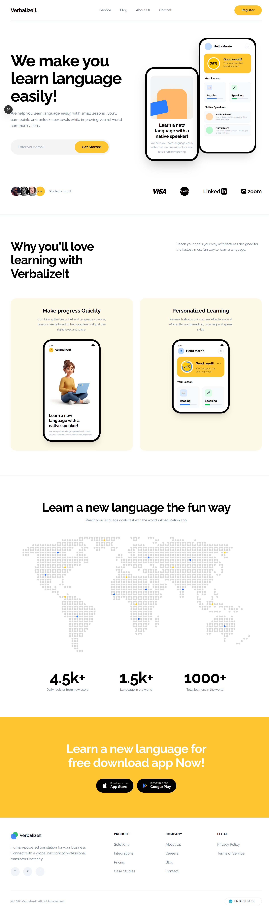

# VerbalizeIt — Language Learning Landing Page

A modern, responsive landing page for **VerbalizeIt**, a language learning application. Built with Next.js 15, Tailwind CSS 4, and TypeScript.



---

## ✨ Features

- **Responsive Design** — Fully optimized for desktop, tablet, and mobile screens
- **Modern UI** — Clean, minimal aesthetic with a warm yellow accent palette
- **Interactive Phone Mockups** — CSS-crafted mobile app previews showcasing the product
- **Dotted World Map** — Global presence visualization with colored location markers
- **Stats Section** — Animated counters highlighting key metrics (4.5k+ users, 1.5k+ languages, 1000+ learners)
- **Download CTA** — Prominent call-to-action banner with App Store & Google Play buttons
- **Brand Marquee** — Trusted-by logos (VISA, Spotify, LinkedIn, Zoom)

## 🧱 Sections

| Section | Description |
| --- | --- |
| **Navbar** | Sticky navigation with logo, links (Service, Blog, About Us, Contact), and Register CTA |
| **Hero** | Bold headline, email signup, dual phone mockups with yellow accent blob |
| **Why You'll Love It** | Two-column header + two feature cards with embedded phone UIs |
| **Learn the Fun Way** | Centered heading, dotted world map, three stat counters |
| **Download CTA** | Yellow banner with App Store & Google Play download buttons |
| **Footer** | Brand info, product/company/legal links, social icons, language selector |

## 🛠️ Tech Stack

- **Framework:** [Next.js 15](https://nextjs.org/) (App Router)
- **Styling:** [Tailwind CSS 4](https://tailwindcss.com/)
- **Language:** TypeScript
- **Font:** [Raleway](https://fonts.google.com/specimen/Raleway) (Google Fonts)
- **Icons:** [Lucide React](https://lucide.dev/)
- **Package Manager:** [Bun](https://bun.sh/)

## 🚀 Getting Started

### Prerequisites

- [Node.js 18+](https://nodejs.org/) or [Bun](https://bun.sh/)

### Installation

```bash
# Clone the repository
git clone https://github.com/gitadityakumar/Landing-pages.git
cd Landing-pages/08_verbalizett

# Install dependencies
bun install
# or
npm install

# Start the development server
bun dev
# or
npm run dev
```

Open [http://localhost:3000](http://localhost:3000) in your browser.

### Build for Production

```bash
bun run build
bun start
```

## 📁 Project Structure

```
08_verbalizett/
├── app/
│   ├── globals.css        # Global styles & Tailwind config
│   ├── layout.tsx         # Root layout with Raleway font
│   └── page.tsx           # Main page composition
├── components/
│   ├── Navbar.tsx         # Navigation bar
│   ├── Hero.tsx           # Hero section with phone mockups
│   ├── MobileFeature.tsx  # Feature cards with phone UIs
│   ├── IntegrationFeature.tsx  # World map & stats section
│   ├── DownloadCTA.tsx    # Download call-to-action banner
│   └── Footer.tsx         # Footer with links & social
├── public/
│   ├── preview.png        # Full page screenshot
│   ├── worldmap.png       # Dotted world map asset
│   ├── study-character.png # 3D character illustration
│   ├── mobile.webp        # Mobile mockup image
│   ├── mocup1.webp        # Desktop mockup image
│   └── mockup2.webp       # Secondary mockup image
└── package.json
```

## 🎨 Design Highlights

- **Color Palette:** White backgrounds with `#fdc630` (golden yellow) as the primary accent
- **Typography:** Raleway font family across all weights (100–900)
- **Cards:** Warm cream (`#fef9e7`) feature cards with embedded phone mockups
- **Phone Mockups:** Built entirely with CSS — rounded corners, black bezels, status bars, and interactive UI elements

## 📄 License

This project is open source and available under the [MIT License](LICENSE).

---

Built with ❤️ by [Aditya Kumar](https://github.com/gitadityakumar)
