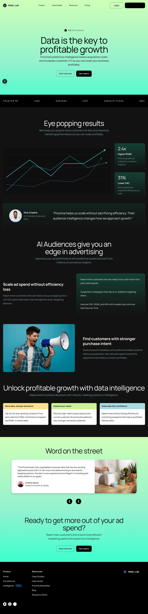

# Halal_Lab Predictive Intelligence Landing Page

A responsive marketing landing page built with Next.js App Router, React, TypeScript, and Tailwind CSS.

## Preview



## Tech Stack


## Features

- App Router project structure using server components by default
- Full-width multi-section marketing landing page
- Section-based component architecture for maintainability
- Local custom fonts via `next/font/local`
- Optimized assets rendered with `next/image`
- Tailwind CSS v4 styling with custom design tokens and utility classes

## Project Structure

```text
.
├── app/
│   ├── globals.css
│   ├── layout.tsx
│   └── page.tsx
├── components/
│   ├── audiences-section.tsx
│   ├── footer-section.tsx
│   ├── hero-section.tsx
│   ├── page-utils.ts
│   ├── results-section.tsx
│   └── testimonials-section.tsx
└── public/
    ├── design-assets/
    └── readme/
```

## Getting Started

### Prerequisites

- Node.js 20 or newer
- npm

### Installation

```bash
npm install
```

### Run Locally

```bash
npm run dev
```

Open [http://localhost:3000](http://localhost:3000).

## Available Scripts

```bash
npm run dev
npm run build
npm run start
npm run lint
```
